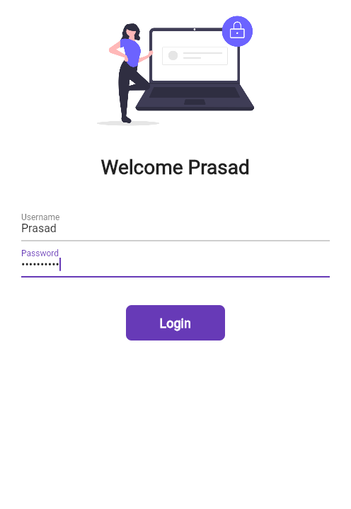
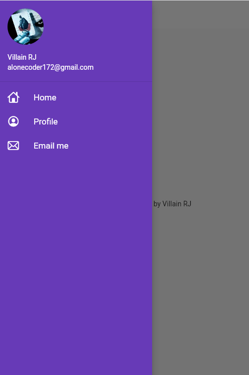

# App-In-Progress
`<!-- Title -->

<h1 align="center">A Catalog App</h1>

## Overview

The Catalog Flutter App is an e-commerce app that showcases various products in different categories. Users can browse the catalog, view product details, and add items to their shopping cart.

## Features

- Display a wide range of products in different categories.
- View detailed information about each product, including images, descriptions, and prices.
- Add products to the shopping cart for easy checkout.
- A user-friendly and intuitive interface for a smooth shopping experience.

## Screenshots

<!-- Add your app screenshots here -->
<p align="center">
  
  
  
</p>

## Installation

To run the app on your device, follow these steps:

1. Ensure you have Flutter installed on your computer. If not, follow the official Flutter installation guide: [Flutter Installation Guide](https://flutter.dev/docs/get-started/install)

2. Clone this repository or download the ZIP file and extract it to a location of your choice.

3. Open the project in your favorite code editor (e.g., Visual Studio Code).

4. Connect your Android or iOS device to your computer.

5. Run the following command in the terminal to install the required dependencies:

```bash
flutter pub get
```
6.  Once the dependencies are installed, run the app on your device:

```bash

flutter run
```
or you can just run main.dart and your Catalog App is ready!

## Usage

-   Launch the app on your device.
-   Browse through the catalog by selecting different categories.
-   View detailed product information by tapping on individual items.
-   Add products to your shopping cart for easy checkout.

## Contribution

Contributions to this project are welcome. If you encounter any bugs, have suggestions, or want to add new features, please create a pull request. Please ensure that your code follows Flutter's best practices and includes appropriate documentation.

## License

This project is licensed under the MIT License.

## Contact

For any inquiries or feedback, please contact the project maintainer:

Email: [rajchaudhari2528@gmail.com](https://mail.google.com/mail/u/0/?fs=1&tf=cm&source=mailto&to=rajchaudhari2528@gmail.com) 

LinkedIn: [Prasad Chaudhari](https://www.linkedin.com/in/prasad-chaudhari-45b975228/)

Feel free to reach out for any questions or collaborations.

----------

Thank you for using the Catalog Flutter App! We hope you enjoy browsing through our diverse selection of products. If you find the app helpful, consider giving it a star on GitHub and sharing it with your friends. Happy shopping! 🛍️
